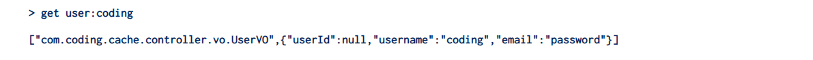

# Redis 缓存

## 一、配置 Redis

首先，我们基于搭建 SpringBoot 和 Redis 的集成环境。这里使用 Redission 作为操作 Redis 的客户端

::: code-group

```xml [添加依赖]
<dependency>
    <groupId>org.redisson</groupId>
    <artifactId>redisson-spring-boot-starter</artifactId>
    <version>3.41.0</version>
    <exclusions>
        <exclusion>
            <groupId>org.springframework.boot</groupId>
            <artifactId>spring-boot-starter-actuator</artifactId>
        </exclusion>
        <exclusion>
            <groupId>org.redisson</groupId>
            <!-- 使用 redisson-spring-data-27 替代，解决 Tuple NoClassDefFoundError 报错 -->
            <artifactId>redisson-spring-data-34</artifactId>
        </exclusion>
    </exclusions>
</dependency>
<dependency>
    <groupId>org.redisson</groupId>
    <artifactId>redisson-spring-data-27</artifactId>
    <version>3.41.0</version>
</dependency>
```

```yml [配置 Redis 连接]
spring:
  redis:
    host: 192.168.5.14
    port: 7001
    password: 123456
    database: 1
```

```java [修改序列化]
@Bean
@Primary
public RedisTemplate<String, Object> redisTemplate(RedisConnectionFactory factory) {
    // 创建 RedisTemplate 对象
    RedisTemplate<String, Object> template = new RedisTemplate<>();
    // 设置 RedisConnection 工厂
    template.setConnectionFactory(factory);
    // 使用 String 序列化方式，序列化 KEY 。
    template.setKeySerializer(RedisSerializer.string());
    template.setHashKeySerializer(RedisSerializer.string());
    // 使用 JSON 序列化方式（库是 Jackson ），序列化 VALUE 。
    template.setValueSerializer(buildRedisSerializer());
    template.setHashValueSerializer(buildRedisSerializer());
    return template;
}

public static RedisSerializer<?> buildRedisSerializer() {
    Jackson2JsonRedisSerializer<Object> json = new Jackson2JsonRedisSerializer<>(Object.class);
    ObjectMapper om = new ObjectMapper();
    om.configure(DeserializationFeature.FAIL_ON_UNKNOWN_PROPERTIES, false);
    om.setVisibility(PropertyAccessor.ALL, JsonAutoDetect.Visibility.ANY);
    om.activateDefaultTyping(LaissezFaireSubTypeValidator.instance, ObjectMapper.DefaultTyping.NON_FINAL);
    //解决redis对java8时间类型LocalDateTime， LocalTime等序列号反序列化异常的问题
    om.disable(SerializationFeature.WRITE_DATES_AS_TIMESTAMPS);
    om.registerModule(new JavaTimeModule());
    json.setObjectMapper(om);
    return json;
}
```

:::

## 二、SpringBoot Cache

在 SpringBoot 之中，可以通过注解的方式，实现缓存的写入和删除，这主要依赖于 `spring-boot-starter-cache` 组件

```xml
<dependency>
    <groupId>org.springframework.boot</groupId>
    <artifactId>spring-boot-starter-cache</artifactId>
</dependency>
```

### 2.1 配置 Cache

对应的配置类代码如下：

::: code-group

```java [配置]
@Configuration
@EnableCaching
public class CacheAutoConfiguration {
    @Bean
    @Primary
    public RedisCacheConfiguration redisCacheConfiguration(CacheProperties cacheProperties) {
        RedisCacheConfiguration config = RedisCacheConfiguration.defaultCacheConfig();
        config = config.computePrefixWith(cacheName -> {
            String keyPrefix = cacheProperties.getRedis().getKeyPrefix();
            if (StringUtils.hasText(keyPrefix)) {
                keyPrefix = keyPrefix.lastIndexOf(":") == -1 ? keyPrefix + ":" : keyPrefix;
                return keyPrefix + cacheName + ":";
            }
            return cacheName + ":";
        });
        // 设置使用 JSON 序列化方式
        config = config.serializeValuesWith(RedisSerializationContext.SerializationPair.fromSerializer(buildRedisSerializer()));

        // 设置 CacheProperties.Redis 的属性
        CacheProperties.Redis redisProperties = cacheProperties.getRedis();
        if (redisProperties.getTimeToLive() != null) {
            config = config.entryTtl(redisProperties.getTimeToLive());
        }
        if (!redisProperties.isCacheNullValues()) {
            config = config.disableCachingNullValues();
        }
        if (!redisProperties.isUseKeyPrefix()) {
            config = config.disableKeyPrefix();
        }
        return config;
    }
}
```

```yml [修改配置文件]
spring:
  cache:
    type: Redis
    redis:
      time-to-live: 1h
      key-prefix: cache-server
```

:::

### 2.2 常用注解

这里我们准备一个简单的接口

```java
@RestController
@RequestMapping("/user")
@Slf4j
public class UserController {
    @PostMapping("/getUserByUserName")
    public UserVO getUserByUserName(@RequestBody UserReq userReq) {
        log.info("读取到的用户信息为：{}", userReq);
        UserVO userVO = new UserVO();
        userVO.setUsername("coding");
        userVO.setEmail("password");
        return userVO;
    }
}
```

下面就演示一下常用的注解的使用

#### 2.2.1 @Cacheable

> 作用：添加在方法上，缓存方法的执行结果，如果下一次请求进入，如果请求参数一致，就会直接返回结果

这个注解常用的属性如下：

- cacheNames：缓存名
- value：缓存名，和 cacheNames 一致
- key：缓存的 key，通过 SPEL 表达式进行配置
  - 如果为空：默认方法的所有参数进行组合
- condition：通过方法入参，**判断要建立缓存的条件**
- unless：通过方法出参，**判断不建立缓存的条件**
- sync：在获取不到缓存的情况之下，是否同步执行方法
  - 默认为：false，表示无需进行同步

下面就来实际演示一下：

```java
@PostMapping("/getUserByUserName")
@Cacheable(cacheNames = "user", key = "#userReq.username")
public UserVO getUserByUserName(@RequestBody UserReq userReq) {
    log.info("读取到的用户信息为：{}", userReq);
    UserVO userVO = new UserVO();
    userVO.setUsername("coding");
    userVO.setEmail("password");
    return userVO;
}
```

当第二次调用方法之后，在 Redis 之中就会存储对应的数据，Redis 之中存储的内容示例如下：



如果有多个服务，公用一个 Redis 服务，为了防止多个服务之间 Redis Key 定义重复，对于缓存 key，可以通过如下方式进行解决：

```yml
spring:
  cache:
    redis:
      key-prefix: cache-server
```

#### 2.2.2 @CachePut

> 作用：添加在方法之上，缓存方法的执行结果，**无论请求参数是否一致，都会执行这个方法**，然后判断是否满足缓存的条件，如果满足，则缓存方法的结果到缓存之中

两个注解的属性基本一致，只是少了一个 `sync` 属性

测试代码如下：

```java
@PostMapping("/getUserByUserName2")
@CachePut(value = "user2", key = "#userReq.username", condition = "#userReq.username.equals('coding')")
public UserVO getUserByUserName2(@RequestBody UserReq userReq) {
    String uuid = UUID.randomUUID().toString();
    log.info("读取到的用户信息为2：{}, 生成的UUID 为：{}", userReq, uuid);
    UserVO userVO = new UserVO();
    userVO.setUsername("coding");
    userVO.setEmail(uuid);
    return userVO;
}
```

按照注解的作用，每一次请求都会执行方法，但是如果满足 username = coding， 则缓存方法的返回结果

1）第一次调用

```markdown
# 日志
读取到的用户信息为2：UserReq(username=coding), 生成的UUID 为：62b18d41-c9a3-4cce-9c87-678a2d7ceae3

# Redis 
> get cache-server:user2:coding
["com.coding.cache.controller.vo.UserVO",{"userId":null,"username":"coding","email":"62b18d41-c9a3-4cce-9c87-678a2d7ceae3"}]
```

2）第二次调用

```markdown
# 日志
读取到的用户信息为2：UserReq(username=coding), 生成的UUID 为：adf040d8-ab0c-4a95-b08e-f4f132f8bce7

# Redis 
> get cache-server:user2:coding
["com.coding.cache.controller.vo.UserVO",{"userId":null,"username":"coding","email":"adf040d8-ab0c-4a95-b08e-f4f132f8bce7"}]
```

3）第三次调用，更改用户名，发现 Redis 中的数据并没有发生变化，仍然是第二次调用的数据

::: info

相比于 @Cacheable 注解，@CachePut 是按照配置的条件，主动去写缓存，不去读取

:::

#### 2.2.3 @CacheEvict

> 作用：添加在方法之上，删除缓存

```java
@PostMapping("/deleteByUsername")
@CacheEvict(value = "user2", key = "#userReq.username", condition = "#userReq.username.equals('coding')")
public String deleteUserByUsername(@RequestBody UserReq userReq) {
    log.info("读取到的用户信息为2：{}", userReq);
    return "success";
}
```

当我们通过 2.3.1.2 的测试代码，执行完成之中，Redis 之中写入了数据，此时调用 deleteByUsername 请求，调用完成之中，查看Redis 之中，对应的缓存数据，已经被删除
